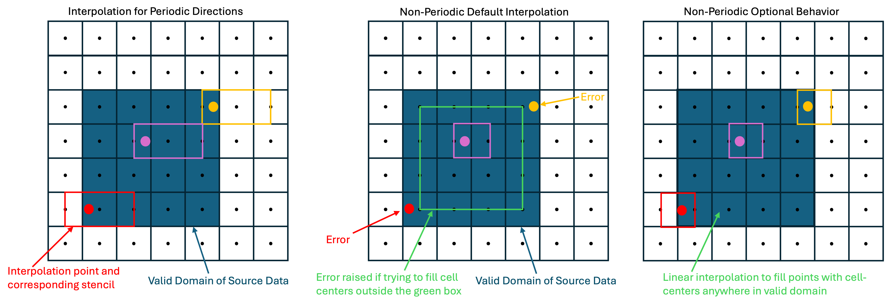

.. highlight:: rst

.. _sec:Utility:

*******
Utility
*******

In addition to routines for evaluating chemical reactions, transport properties, and equation of state functions, PelePhysics includes other shared utilities that are utilized by both PeleC and PeleLM(eX). These utilities include support for:

* Premixed Flame (``PMF``) initialization from precomputed 1D flame profiles
* Turbulent inflows (``TurbInflow``) on domain boundaries from saved turbulence data
* Forced Turbulence (``TurbForce``) for maintained HIT
* Plt file management (``PltFileManager``)
* Output of runtime ``Diagnostics``
* Basic ``Utilities``, including unit conversions

This section provides relevant notes on using these utilities across the Pele family of codes. There may be additional subtleties based on the code-specific implementation of these capabilities, in which case it will be necessary to refer to the documentation of the code of interest.

Premixed Flame Initialization
=============================

Pre-computed profiles from 1D freely propagating premixed flames are used to initialize a wrinkled `flamesheet <https://amrex-combustion.github.io/PeleLMeX/manual/html/Tutorials_FlameSheet.html>`_ in PeleLMeX, among other problems. Right now, this capability is not used in PeleC, but similar code that accomplishes the same task using data files of the same format is applied in PeleC. The code has two parts, a data container defined in ``PMFData.{H,cpp}`` that loads and stores data from the pre-computed profile, and a function defined in ``PMF.H`` that, when provided this data structure and the bounds of a cell of interest, returns temperature, velocity, and mole fractions from that location.

This code has two runtime parameters that may be set in the input file: ::

  pmf.datafile = pmf.dat
  pmf.do_cellAverage = 1

The first parameter specifies the path to the PMF data file. This file contains a two-line header followed by whitespace-delimited data columns in the order: position (cm), temperature (K), velocity (cm/s), density(g/cm3), species mole fractions. Sample files are provided in the relevant PeleLMeX (and PeleC) examples, and the procedure to generate these files with a provided script is described below. The second parameter specifies whether the PMF code does a finite volume-style integral over the queried cell (``pmf.do_cellAverage = 1``) or whether the code finds an interpolated value at the midpoint of the queried cell (``pmf.do_cellAverage = 0``)

Generating a PMF file
~~~~~~~~~~~~~~~~~~~~~

The script ``cantera_pmf_generator.py`` solves a 1D unstrained premixed flame using `Cantera <https://doi.org/10.5281/zenodo.6387882>`_ and saves it in the appropriate file format for use by the Pele codes. To use this script, first follow the :ref:`CEPTR instructions <sec_ceptr_software>` for setting up ``poetry``. Then return to the ``Utility/PMF/`` directory and run the script: ::

  poetry -C ../../../Support/ceptr/ run python cantera_pmf_generator.py -m dodecane_lu -f NC12H26 -d 0.01 -o ./

This example computes a dodecane/air flame using the ``dodecane_lu`` mechanism on a 0.01 m domain, and saves the resulting file to the present directory. You may choose any mechanism included with PelePhysics, as the Cantera ``.yaml`` format is included for all mechanisms. If you choose a reduced mechanism with QSS species, the 1D solution will be obtained using the skeletal version of the mechanism without QSS species being remove, as Cantera does not support QSS by default. In this case, the script will also save a data file with QSS species removed (ending in ``-qssa-removed.dat``) that is suitable for use with the QSS mechanisms in Pele. A range of additional conditions may be specified at the command line. To see the full set of options, use the help feature: ::

  poetry -C ../../../Support/ceptr/ run python cantera_pmf_generator.py --help

Note that when running Cantera, you may need to adjust the domain size to be appropriate for your conditions in order for the solver to converge. At times, you may also need to adjust the solver tolerances and other parameters that are specified within the script.

An additional script is provided to allow plotting of the PMF solutions. This script is used as follows (if no variable index is specified, temperature is plotted by default): ::

  poetry -C ../../../Support/ceptr/ run python plotPMF.py <pmf-file> <variable-index>

.. _sec_turbinflow:

Turbulent Inflows
=================

PelePhysics supports the capability of the flow solvers to have spatially and temporally varying inflow conditions based on precomputed planes of
turbulence data (3 components of velocity fluctuations). To reduce memory requirements, a fixed number of planes in the third dimension are read
at a time and then replaced when exhausted. This number of planes can be specified at runtime to balance I/O and memory requirements. Multiple
turbulent inflow patches can be applied on any domain boundary or on multiple domain boundaries. If multiple patches overlap on the same face, the
data from each overlapping patch are superimposed and added together.

This PelePhysics utility provides the machinery to load the data files and interpolate in space and time onto rectangular boundary patches,
which may or may not cover an entire boundary. Additional code within PeleC and PeleLMeX is required to drive this functionality, and the
documentation for the
relevant code should be consulted to fully understand the necessary steps. Typically, the TurbInflow capability provides velocity fluctuations,
and the mean inflow velocity must be provided through another means. For each code, an example test case for the capability is provided
in `Exec/RegTests/TurbInflow`. Inputs are available as part of this utility to rescale the data as needed. If differently shaped inlet patches
are required, this must be done by masking undesired parts of the patch on the PeleC or PeleLMeX side of the implementation.

Generating a turbulence file
~~~~~~~~~~~~~~~~~~~~~~~~~~~~

The relevant data files are generated using the tools in ``Support/TurbInflowGenerator``
and usage instructions are available in the :ref:`documentation <sec_turbfile>` on these tools.

Input file options
~~~~~~~~~~~~~~~~~~

The input file options that drive this utility (and thus are inherited by PeleC and PeleLMeX) are
provided below. ::

  turbinflows=low high                                    # Names of injections (can provide any number)

  turbinflow.low.turb_file      = TurbFileHIT/TurbTEST    # Path to directory created in previous step
  turbinflow.low.dir            = 1                       # Boundary normal direction (0,1, or 2) for patch
  turbinflow.low.side           = "low"                   # Boundary side (low or high) for patch
  turbinflow.low.turb_scale_loc = 633.151                 # Factor by which to scale the spatial coordinate between the data file and simulation
  turbinflow.low.turb_scale_vel = 1.0                     # Factor by which to scale the velocity between the data file and simulation
  turbinflow.low.turb_center    = 0.005 0.005             # Center point where turbulence patch will be applied
  turbinflow.low.turb_conv_vel  = 5.                      # Velocity to move through the 3rd dimension to simulate time evolution
  turbinflow.low.turb_nplane    = 32                      # Number of planes to read and store at a time
  turbinflow.low.time_offset    = 0.0                     # Offset in time for reading through the 3rd dimension
  turbinflow.low.verbose        = 0                       # verbosity level
  turbinflow.low.extrap_nonperiodic = 0                   # Allow interpolation near edges of inflow patch where stencil may touch ghost cells
  turbinflow.low.tile_periodic  = 0                       # cover the entire inflow face by periodically repeating/tiling the inflow patch
  turbinflow.interp_type        = quadratic               # either quadratic (default) or linear (required if there are nonperiodic directions)

  turbinflow.high.turb_file      = TurbFileHIT/TurbTEST   # All same as above, but for second injection patch
  turbinflow.high.dir            = 1
  turbinflow.high.side           = "high"
  turbinflow.high.turb_scale_loc = 633.151
  turbinflow.high.turb_scale_vel = 1.0
  turbinflow.high.turb_center    = 0.005 0.005
  turbinflow.high.turb_conv_vel  = 5.
  turbinflow.high.turb_nplane    = 32
  turbinflow.high.time_offset    = 0.0006
  turbinflow.high.verbose        = 2

TurbInflow Implementation Details
~~~~~~~~~~~~~~~~~~~~~~~~~~~~~~~~~
To facilitate application of inflows generated from precursor Pele simulations, the data in the inflow files is now always interpreted as
cell-centered, which is a departure from legacy implementations designed to use fully-periodic data originating from solvers with nodal data.
However, some aspects of the implementation are still influenced by the legacy implementation. A main consideration in the current implementation
is that an inflow generated from a precursor simulation (using either of the ``periodic_plt`` or ``diag_frame_plane`` generation options) can
be directly applied as an inflow to a second simulation on the same grid without interpolation or data shifting.

Each TurbInflow plane contains a valid box corresponding to the physical domain used to generate the inflow plane,
plus one ghost cell on the low side and two ghost cells on the high side. But the dimensions listed
in the ``HDR`` correspond to the size of valid domain in the tangential directions plus two grid cell sizes. The normal direction dimension is just
the valid domain size. The behavior of the utility depends on the periodicity of the data. If the data is periodic in the normal direction, it is
treated as spatial data, the normal direction is traversed based on the specified ``turb_conv_vel``, and the inflow data can be recycled to allow
arbitrarily long simulations. If the data is not periodic in the normal direction, a list of time stamps for each plane is provided at the end of
the ``HDR`` file. The inflow is only valid from the first time stamp through, but not including, the 2nd last time stamp (the final plane
is necessary for interpolation).

For tangential directions, periodicity influences the type of interpolation that may be applied. For periodic tangential dimensions, quadratic
interpolation with a three point stencil is used by default, but linear interpolation is also available. The quadratic stencil is asymmetric,
using one point to the left and two to the right. Periodic directions may be tiled to cover the full face of the inflow using the `tile_periodic`
option, but by default they cover any cell of the simulation that has its center within the valid domain of the inflow. For nonperiodic
directions, linear interpolation is required. Because interpolation the outer 1/2 cell perimeter of a nonperiodic valid domain would
require an interpolation stencil that uses a ghost cell, and ghost cells may not be meaningfully populated (they are currently filled by
first order extrapolation), by default an error is raised if the TurbInflow utility is asked to populate a cell center in this region. This
error can be disabled with the ``extrap_nonperiodic`` option. In general, for nonperiodic directions, it is recommended to generate an inflow
that matches the grid from the finest level of the simulation using the inflow. The figure below demonstrates the structure of the turb
inflow plane data and interpolation approaches for periodic and nonperiodic tangential directions.

.. note:: The TurbInflow capability was not designed with embedded boundaries in mind. It can be applied for simulations using EB, but care should
          be take. Inflows should not be generated from simulations where EBs intersect the inflow plane.

.. _sec_turbforce:

Forced Turbulence
=================

PelePhysics supports the capability for maintained homogeneous isotropic turbulence.  A source term in the momentum equation injects energy at
large scales, which naturally cascades to form (maintained) homogeneous isotropic turbulence.

Input file options
~~~~~~~~~~~~~~~~~~

The input file options that drive this utility (and thus are inherited by PeleC and PeleLMeX) are
provided below. ::

  turbforce.v                   = 0                       # Verbosity level
  turbforce.urms                = [Must be User Defined]  # Target urms
  turbforce.time_offset         = 0.0                     # Offset of the forcing function.
  turbforce.hack_lz             = 0                       # Allow periodic reproduction in z.
  turbforce.force_scale_fudge   = 1.0                     # Used for fine scale tuning of the forcing function.

  turbforce.ff_factor           = 4                       # Fast force coarsening factor.
  turbforce.nmodes              = 4                       # Largest mode to force.
  turbforce.forcing_epsilon     = 0.1                     # Reduce amplitude of modes used for breaking symmetry.
  turbforce.spectrum_type       = 2                       # Shape of the spectrum of the forcing.
  turbforce.moderate_zero_modes = 1                       # Reduce the impact of any zero mode.
  turbforce.mode_start          = 0                       # Starting mode

For ff_factor, nmodes, forcing_epsilon, spectrum_type and moderate_zero_modes, it is best to leave these as defaults unless you are confident on
the consiquences.

Forced Turbulence Implementation Details
~~~~~~~~~~~~~~~~~~~~~~~~~~~~~~~~~~~~~~~~

The strategy is to inject energy into the large scales using a source term in the momentum equation; the turbulence then develops naturally through the Richardson-Kolmogorov cascade.  The original description is in `Aspden et al. <https://doi.org/10.2140/camcos.2008.3.103>`_; a few modifications (e.g. tweaking the amplitudes of the modes through the random seed, which reduced the temporal variation in u_rms) and explicitly using a divergence-free form (see `Almgren et al. <https://doi.org/10.1137/110829386>`_). We typically run in a cube, or 4:1 box; larger boxes can achieved using the hack_lz option, which uses a periodic reproduction of the forcing in the z direction.  As the source term is a superposition of a substantial number of fourier modes, the direct evaluation is computationally expensive.  The resulting field is smooth (as we're forcing the large scales), so for computational efficiency, the source term is evaluated on a coarser box (by ff_factor, usually 4), and interpolated onto the required resolution; this is substantially faster, and indistinguishable from the direct approach.

Plt File Management
===================

This code contains data structures used to handle data read from plt files that is utilized by the routines that allow the code to be restarted based on data from plt files.

.. _sec_diagnostics:

Diagnostics
===========

Analysing the data a-posteriori can become extremely cumbersome when dealing with extreme datasets.
PelePhysics supports shared capability for diagnostics available at runtime during PeleC and PeleLMeX simulation
and more are under development.
Currently, the list of diagnostic contains:

* ``DiagFramePlane`` : extract a plane aligned in the 'x','y' or 'z' direction across the AMR hierarchy, writing
  a 2D plotfile compatible with Amrvis, Paraview or yt. Only available for 3D simulations.
* ``DiagPDF`` : extract the PDF of a given variable and write it to an ASCII file.
* ``DiagConditional`` : extract statistics (average and standard deviation, integral or sum) of a
  set of variables conditioned on the value of given variable and write it to an ASCII file.

When using `DiagPDF` or `DiagConditional`, it is possible to narrow down the diagnostic to a region of interest
by specifying a set of filters, defining a range of interest for a variable. Note also that for these two diagnostics,
fine-covered regions are masked. An arbitrary number of diagnostics can be named in a list with the ``diagnostics``
keyword, then each diagnostic name in the list becomes a keyword allowing the type and specific options for
that diagnostic to be specified.
The following provide examples for each diagnostic in PeleLMeX (in PeleC, all diagnostics would be prefixed with
`pelec` instead of `peleLM`:

::

    #--------------------------DIAGNOSTICS------------------------

    peleLM.diagnostics = xnormP condT pdfTest

    peleLM.xnormP.type = DiagFramePlane                             # Diagnostic type
    peleLM.xnormP.file = xNorm5mm                                   # Output file prefix
    peleLM.xnormP.normal = 0                                        # Plane normal (0, 1 or 2 for x, y or z)
    peleLM.xnormP.center = 0.005                                    # Coordinate in the normal direction
    peleLM.xnormP.int    = 5                                        # Frequency (as step #) for performing the diagnostic
    peleLM.xnormP.interpolation = Linear                            # [OPT, DEF=Linear] Interpolation type : Linear or Quadratic
    peleLM.xnormP.field_names = x_velocity mag_vort density         # List of variables outputted to the 2D pltfile
    peleLM.xnormP.n_files = 2                                       # [OPT, DEF="min(256,NProcs)"] Number of files to write per level
    peleLM.xnormP.dump_ghost_if_OOB = 1                             # [OPT, DEF=false] if the specified coordinate is out-of-bounds, a plane of ghost cells in that direction will be dumped (for debugging purposes). If false, an error is raised if the requested plane is OOB.
    peleLM.xNormP.dump_flat_3D_plotfile                             # instead of a 2D plotfile, dump a 2D plotfile with 1 cell in the z-direction

    peleLM.condT.type = DiagConditional                             # Diagnostic type
    peleLM.condT.file = condTest                                    # Output file prefix
    peleLM.condT.int  = 5                                           # Frequency (as step #) for performing the diagnostic
    peleLM.condT.filters = xHigh stoich                             # [OPT, DEF=None] List of filters
    peleLM.condT.xHigh.field_name = x                               # Filter field
    peleLM.condT.xHigh.value_greater = 0.006                        # Filter definition : value_greater, value_less, value_inrange
    peleLM.condT.stoich.field_name = mixture_fraction               # Filter field
    peleLM.condT.stoich.value_inrange = 0.053 0.055                 # Filter definition : value_greater, value_less, value_inrange
    peleLM.condT.conditional_type = Average                         # Conditional type : Average, Integral or Sum
    peleLM.condT.nBins = 50                                         # Number of bins for the conditioning variable
    peleLM.condT.condition_field_name = temp                        # Conditioning variable name
    peleLM.condT.field_names = HeatRelease I_R(CH4) I_R(H2)         # List of variables to be treated

    peleLM.pdfTest.type = DiagPDF                                   # Diagnostic type
    peleLM.pdfTest.file = PDFTest                                   # Output file prefix
    peleLM.pdfTest.int  = 5                                         # Frequency (as step #) for performing the diagnostic
    peleLM.pdfTest.filters = innerFlame                             # [OPT, DEF=None] List of filters
    peleLM.pdfTest.innerFlame.field_name = temp                     # Filter field
    peleLM.pdfTest.innerFlame.value_inrange = 450.0 1500.0          # Filter definition : value_greater, value_less, value_inrange
    peleLM.pdfTest.nBins = 50                                       # Number of bins for the PDF
    peleLM.pdfTest.normalized = 1                                   # [OPT, DEF=1] PDF is normalized (i.e. integral is unity) ?
    peleLM.pdfTest.volume_weighted = 1                              # [OPT, DEF=1] Computation of the PDF is volume weighted ?
    peleLM.pdfTest.range = 0.0 2.0                                  # [OPT, DEF=data min/max] Specify the range of the PDF
    peleLM.pdfTest.field_name = x_velocity                          # Variable of interest

Filter
======

A utility for filtering data stored in AMReX data structures. When initializing the ``Filter`` class, the filter type
and filter width to grid ratio are specified. A variety of filter types are supported:

* ``type = 0``: no filtering
* ``type = 1``: standard box filter
* ``type = 2``: standard Gaussian filter

We have also implemented a set of filters defined in Sagaut & Grohens (1999) Int. J. Num. Meth. Fluids:

* ``type = 3``: 3 point box filter approximation (Eq. 26)
* ``type = 4``: 5 point box filter approximation (Eq. 27)
* ``type = 5``: 3 point box filter optimized approximation (Table 1)
* ``type = 6``: 5 point box filter optimized approximation (Table 1)
* ``type = 7``: 3 point Gaussian filter approximation
* ``type = 8``: 5 point Gaussian filter approximation (Eq. 29)
* ``type = 9``: 3 point Gaussian filter optimized approximation (Table 1)
* ``type = 10``: 5 point Gaussian filter optimized approximation (Table 1)

.. warning:: This utility is not aware of EB or domain boundaries. If the filter stencil extends across these boundaries,
             the boundary cells are treated as if they are fluid cells.
             It is up to the user to ensure an adequate number of ghost cells in the arrays are appropriately populated,
             using the ``get_filter_ngrow()`` member function of the class to determine the required number of ghost cells.

Developing
~~~~~~~~~~

The weights for these filters are set in ``Filter.cpp``. To add a
filter type, one needs to add an enum to the ``filter_types`` and
define a corresponding ``set_NAME_weights`` function to be called at
initialization.

The application of a filter can be done on a Fab or MultiFab. The loop nesting
ordering was chosen to be performant on existing HPC architectures and
discussed in PeleC milestone reports. An example call to the filtering operation is

::

   les_filter = Filter(les_filter_type, les_filter_fgr);
   ...
   les_filter.apply_filter(bxtmp, flux[i], filtered_flux[i], Density, NUM_STATE);

The user must ensure that the correct number of grow cells is present in the Fab or MultiFab.

Utilities
=============================
The ``utilities`` namespace contains some functions that may be useful to users when writing problem-specific source code.

This includes unit conversions, which are particularly useful for PeleLM(eX) users working with mixed unit systems. The following aliases, defined in a file header, enable straightforward conversions between MKS and CGS units for use in equation of state (``eos``) function calls:

::

   namespace m2c = pele::physics::utilities::mks2cgs;
   namespace c2m = pele::physics::utilities::cgs2mks;

For example, users can call ``eos.PYT2R`` as follows:

::

   auto eos = pele::physics::PhysicsType::eos();
   amrex::Real P_mean = 101325.0_rt; // Pressure in Pa (MKS)
   amrex::Real massfrac[NUM_SPECIES]; // Mass fractions tracked by PeleLM(eX)
   amrex::Real Temp = 300.0_rt; // Temp in K
   amrex::Real rho_cgs = 0.0_rt; // Density in g/cm^3 (CGS)

   // Calculate density in CGS units, then convert to MKS
   eos.PYT2R(m2c::P(P_mean), massfrac, Temp, rho_cgs);
   amrex::Real rho = c2m::Rho(rho_cgs); // Convert eos density to MKS

The ``utilities`` namespace also contains some other useful functions: ``locate`` to find the nearby indices of a value in an array for interpolation
and ``rectangle_circle_intersection_area`` to find the area of the intersections between rectangles and circles.
